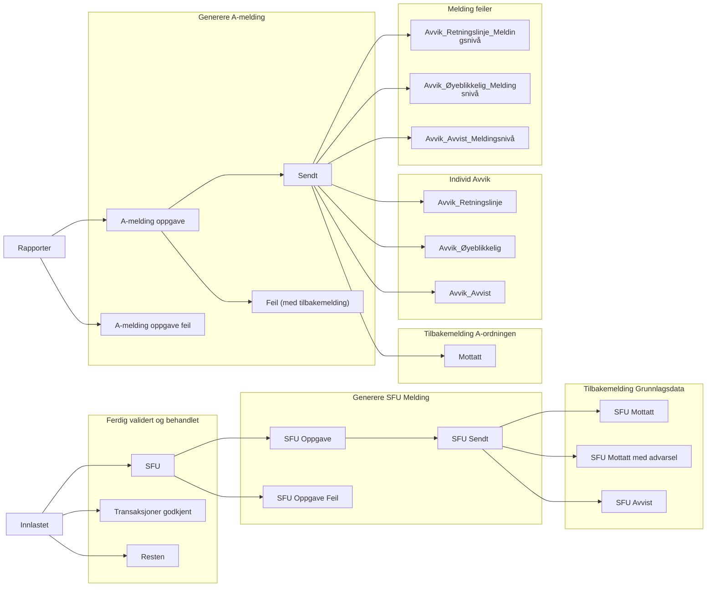

[Gå til heim](README.md)

## Tidspunkt for rapportering


### A-ordningen

- Nav har krav om å rapportere foregående måned innen den 5. i inneværende måned.
- Vanligivs rapporterer Nav til A-ordningen den 1. og den 20. hver måned. I tilfeller hvor dette faller på en rød-dag/helg kan rapportering bli utsatt til første påfølgende virkedag.
- Grunnen for å rapportere 2 ganger hver måned er for å redusere belastningen inn mot Skatteetaten sine systemer pga Nav sitt store volum.


### SFU - Skattefrie utbetalinger
  
* Nav har krav om å rapportere SFU årlig.
* Rapporteres til Grunnlagsdata som er en annen avdeling i Skatteetaten enn dit A-ordningen rapporteres.
* Vanligvis rapporterer Nav SFU den 1. hver måned. I tilfeller hvor dette faller på en rød-dag/helg kan rapportering bli utsatt til første påfølgende virkedag.


---
Statuskoder
---




   
    

    end
    subgraph Transaksjoner godkjent
    b1-->b2
    end
    subgraph Transaksjoner Ikke rapporter
    c1-->c2
c3
    end
```


