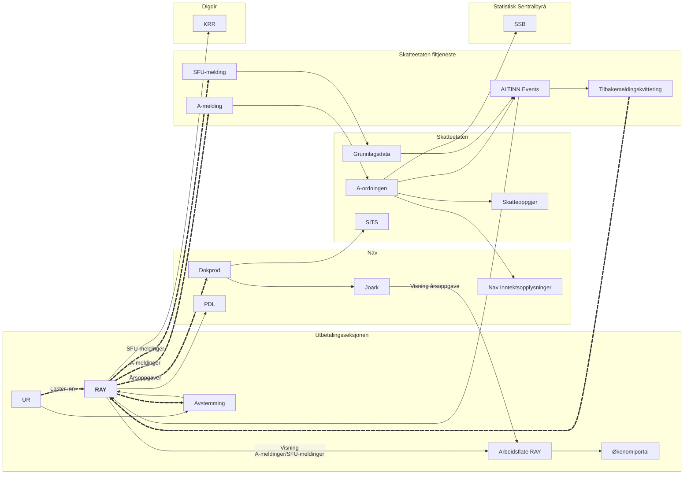

# Informasjonsflyt rundt Rapportering Av Ytelser

**Beskrivelse av interaksjoner**
|**Forkortelse**|**Navn**|**Beskrivelse**|**Linker**|
|:------|:------|:------|:------|
|UR|Utbetalingsreskontro|Håndterer all betalingsformidling mot kontofører (bank) og regnskapsføring på individ.|Team Pengeflyt|
|PDL|Persondataløsningen|Brukes til å hente personopplysninger som navn og adresse.|[PDL Dok](https://pdl-docs.ansatt.nav.no/ekstern/index.html#_m%C3%A5l_og_hensikt)|
|KRR|Kontakt- og reservasjonsregisteret|Brukes til å hente målform på årsoppgave.|Forvaltes av Digdir|
|Dokprod|Dokumentløsninger|Ansvarlig for produksjon og distribusjon av årsoppgaver (Hovedoppgave årlig, endringsoppgave 2 ganger pr mnd)|[Dokprod Dok](https://confluence.adeo.no/spaces/TDOK/pages/340826428/Team+Dokumentl%C3%B8sninger+Admin)|
|Joark||Database med dokumenter, brukes til å hente frem arkivert versjon av årsoppgave.|Forvaltes av Dokprod|
|SSB|Statistisk sentralbyrå|Bruker opplysninger fra A-ordningen til å utarbeide statistikker og forskning.||
|SITS|Skatteetatens IT- og servicepartner|Håndterer utsending av brev.||
